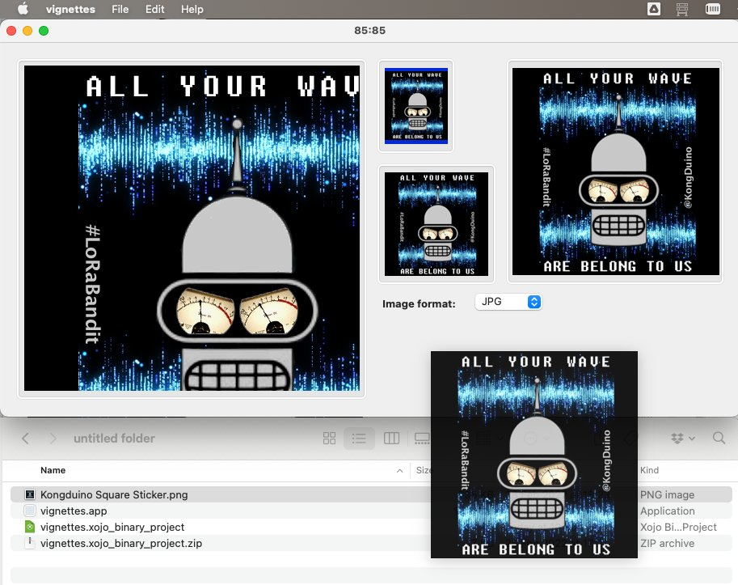

# Xojo_Vignettes

How to drop an image on a Xojo application, resize it, and allow the resized image(s) to be dragged back to the Finder.

### In 3 easy steps!

### Or a quick video

The code makes use of a few nice facilities provided by Xojo:

* `AcceptFileDrop()` --> The user can drop files of (a) certain type(s).
* `MouseDown()` --> When the user clicks down on the Canvas. Creates an image for `MouseDrag`.
* `MouseDrag()` --> When the user starts dragging the image from within the Canvas. Creates a FolderItem and shows the image.
* `DragItem()` --> The object that we will pass to the Finder. Contains a FolderItem.
* Classes. The 3 Canvases supplying the vignettes have a common custom class as Super: code once, reuse as needed.

All in all, this is a very short demonstration – showcasing how Xojo can solve problems quickly and cleanly.

